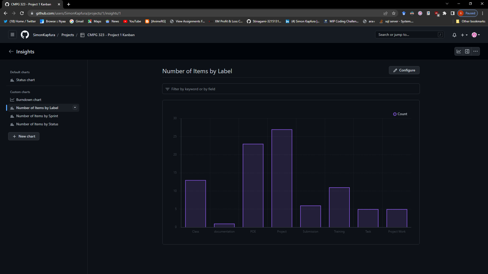
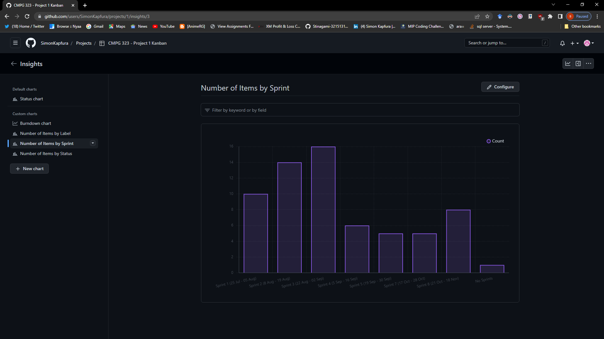
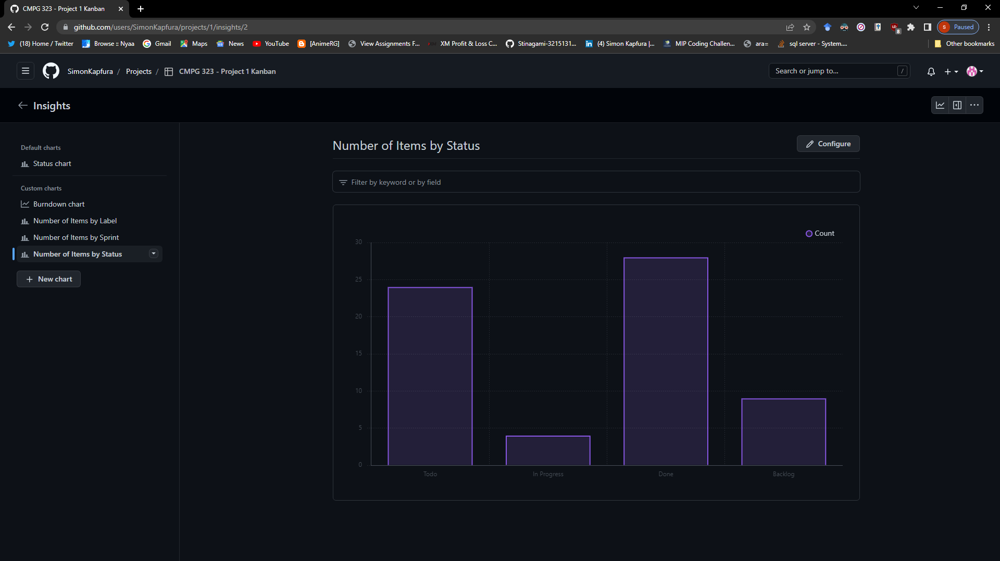
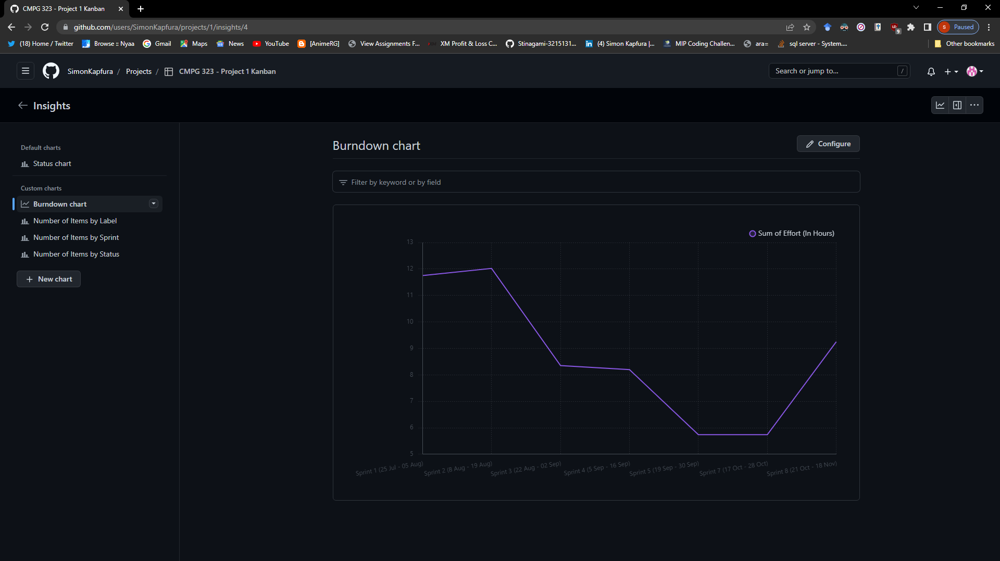

# CMPG-323-Overview---32151314
# CHARTS SCREENSHOTS
- Number of items by label chart
  
- Number of items by sprint chart
  
- Number of items by status chart
  
- Burndown chart
  

## Projects
| Project                                     | Project Repository Link                                   | Due Date          |                                 
| :-----                                      | :---                                                      | :----             |
| Project 1: Agile & Scrum                    | <a href="https://github.com/SimonKapfura/CMPG-323-Overview---32151314">CMPG 323 Project 1 - 32151314</a>              | 18 August 2022    |
| Project 2: API Development                  | <a href="https://github.com/SimonKapfura/CMPG-323-Project-2---32151314">CMPG 323 Project 2 - 32151314</a>              | 08 September 2022 |
| Project 3: Web App Project Testing Patterns | <a href="">CMPG 323 Project 3 - 32151314</a>              | 29 September 2022 |
| Project 4: RPA & Testing Project            | <a href="">CMPG 323 Project 4 - 32151314</a>              | 20 October 2022   |
| Project 5: Reporting Project                | <a href="">CMPG 323 Project 5 - 32151314</a>              | 03 November 2022  |

# Diagram And Project Explanation
Project 1 Branching factor

# Branching strategy for each project
## Project 1
- Project 1 will ony have a master branch because there is no developing or programming yet
- Project 1 will also have another branch that will be responsible for further projects improvements
## Project 2
- This Project will have 3 branches namely main, develop and hotfix
- main will be for basic readMe addidtions
- develop branch will be for the main programming that will occur in the project
- hotfix branch will be for any bug fixes that may occur

## Project 3
- This Project will have 2 branches namely main, develop
- main will be for basic readMe addidtions
- develop branch will be for the main programming that will occur in the project

## Project 4
- This Project will have 4 branches namely main, develop, hotfix and feature
- main will be for basic readMe addidtions
- develop branch will be for the main programming that will occur in the project
- hotfix branch will be for any bug fixes that may occur
- feature branch will be for any additional features to be added to the project

## Project 5
- This Project will have 3 branches namely main, develop and hotfix
- main will be for basic readMe addidtions
- develop branch will be for the main programming that will occur in the project
- hotfix branch will be for any bug fixes that may occur

## Use of .gitignore
The use of .gitignore is important because it tells the system which files should not be regarded as part of the repository. It can be used to ignore some test files that were used to test the codes when it was being developed and they will not be part of the code that will go to the main branch when changes are commited. The .gitignore can also be used to store sensetive information like passwords, authentication tokens and other sensetive information and they will be kept safe from unauthorised access. "Be aware of the possibility that malware can attack your servers by tricking developers into checking in executable files. If possible (depending on your specific application needs), add .exe and .dll files to your .gitignore, so these attacks can’t be executed. If you can't, check to make sure your company signs any executable files before executing them"(Mend, 2021).

## Storage of credentials and sensitive information
Security is very important especially when there will be sensetive information handles, users should rest asured that their information is well secured and can not have unauthorised access. So the storage of sensetive information should be done well to ensure a good and safe service between client and system. Information should be stored in such a way that no one else besides the intended user will not be able to access it, there are many ways to do this and the most poppular and effective one is encryption of the information so that in an even that the information gets leaked somehow it will not be readable because it was encrypted and not just stored as plain text. According to Github (2022) Sensitive information that is stored unencrypted is accessible to an attacker who gains access to the storage. This is particularly important for cookies, which are stored on the machine of the end-user.

# Reference List
TanUv90 (2017). GitHub Readme Images Tutorial (screenshots in readmes). YouTube. Available at: https://www.youtube.com/watch?v=hHbWF1Bvgf4 [Accessed 14 Aug. 2022].

Github.com. (2022). Clear text storage of sensitive information — CodeQL query help documentation. [online] Available at: https://codeql.github.com/codeql-query-help/javascript/js-clear-text-storage-of-sensitive-data/ [Accessed 16 Aug. 2022].

‌Mend. (2021). Top 5 Git Security Mistakes | Mend. [online] Available at: https://www.mend.io/resources/blog/top-5-git-security-mistakes/ [Accessed 18 Aug. 2022].

‌

‌
